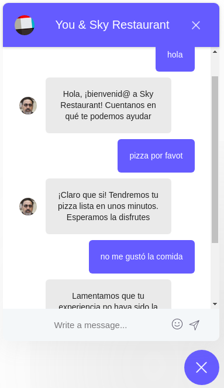

# golang-chatbot

## Golang based chatbot for a restaurant

To run the repository open a terminal, go to $GOPATH/src/github.com, and clone the repository.

    - cd $GOPATH/src/github.com
    - git clone https://github.com/Edigi12Hbtn/golang-chatbot.git

Enter to the directory golang-chatbot/api-chatbot and run go run main/* -mode=t to train the model

    - cd golang-chatbot/api-chatbot
    - go run main/* -mode=t

To launch the api, run:

    - go run main/*

Now the api is listening at http://localhost:3000/sky-restaurant

Open anoter terminal window, go to $GOPATH/src/github.com/golang-chatbot/web-chatbot and run the serve:

    - cd $GOPATH/src/github.com/golang-chatbot/web-chatbot
    - npm install
    - npm run serve

Now the web page is running. Go to http://localhost:8080/#/ in your browser and write a greeting, an opinion about the food or order some food in the chat.

As you can see, the chatbot can understand you even with misspellings! Also, if you go to the terminal where the api was launched you can see the chatbot predictions:

Now, enjoy your imaginary food and tell your opinion to the Chatbot.